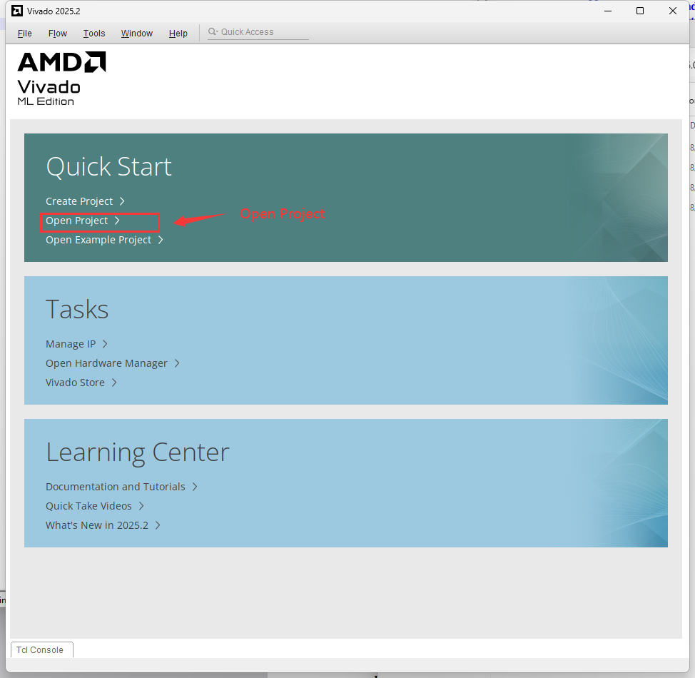
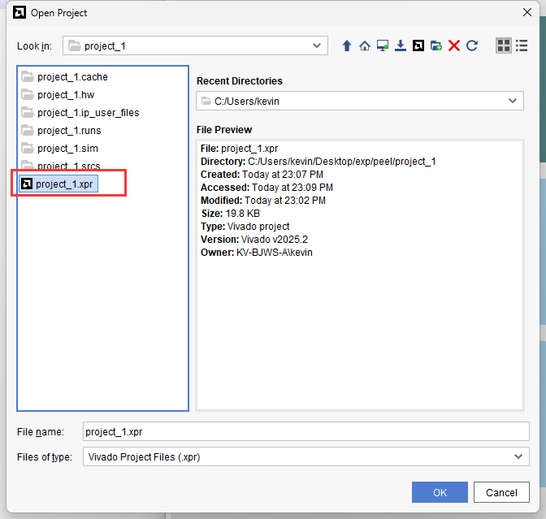
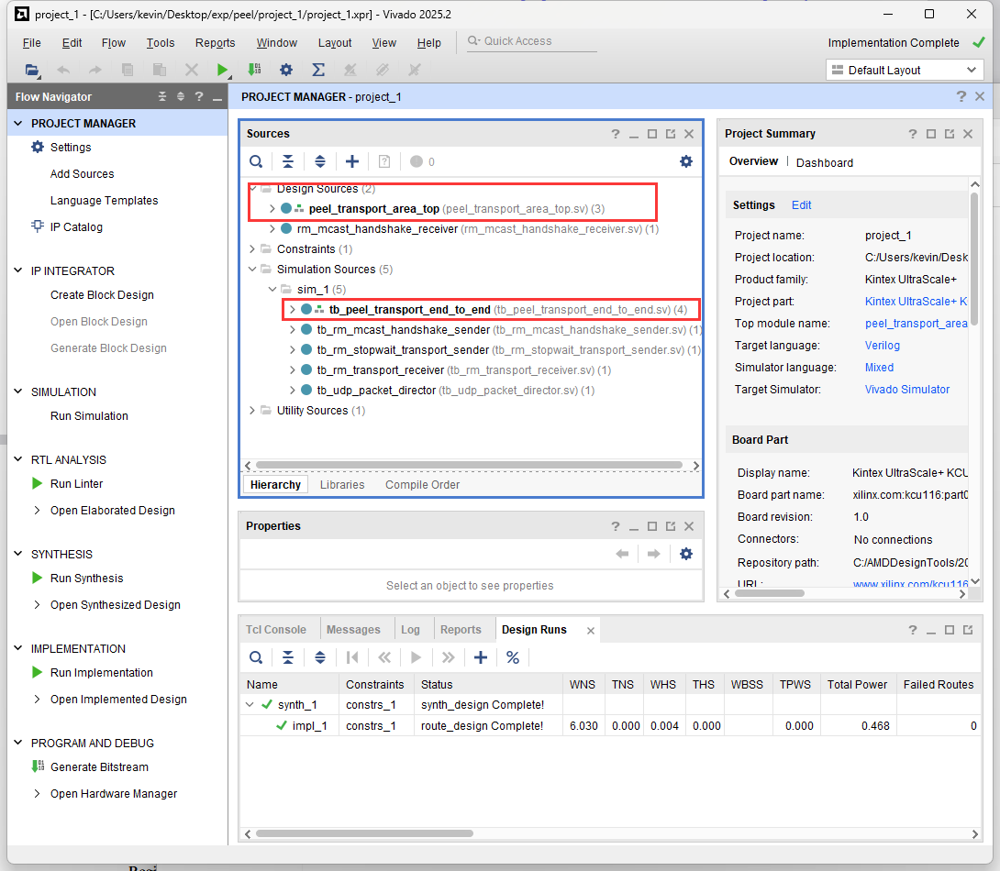
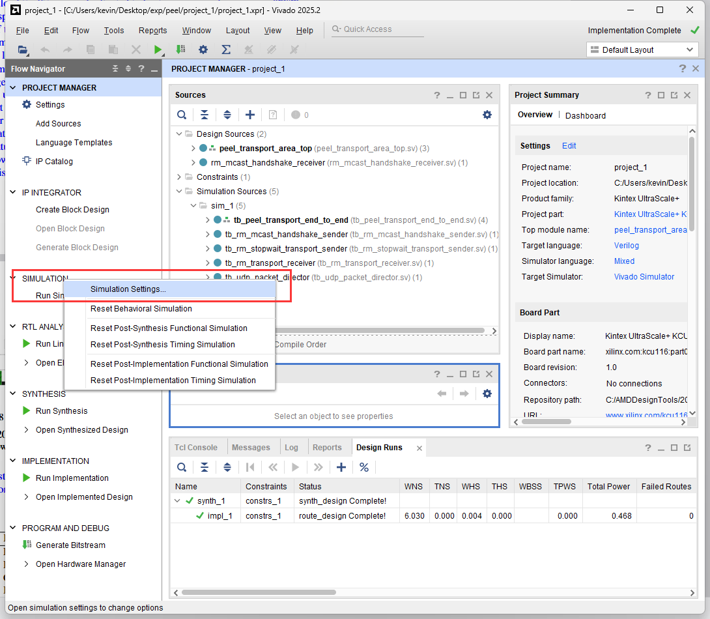
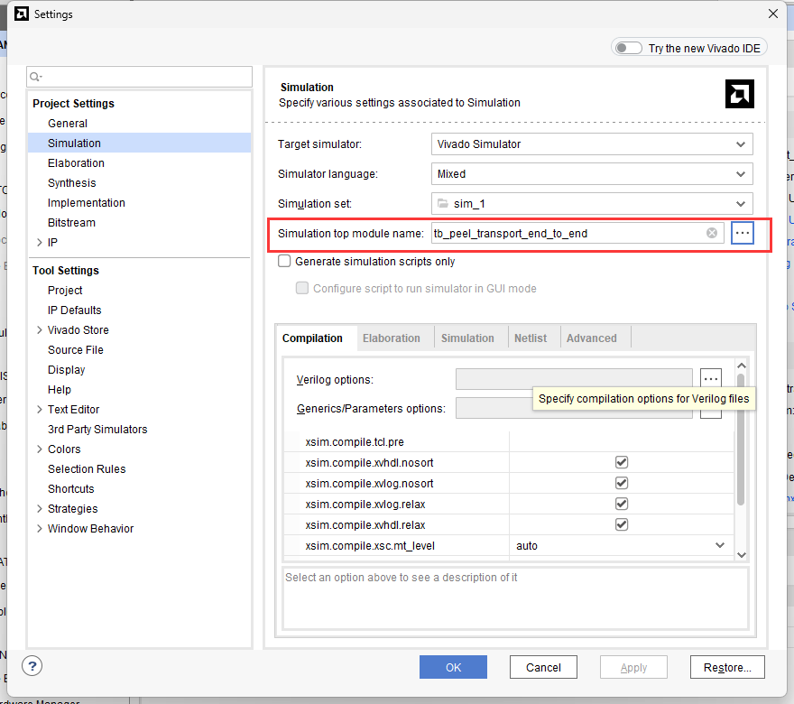
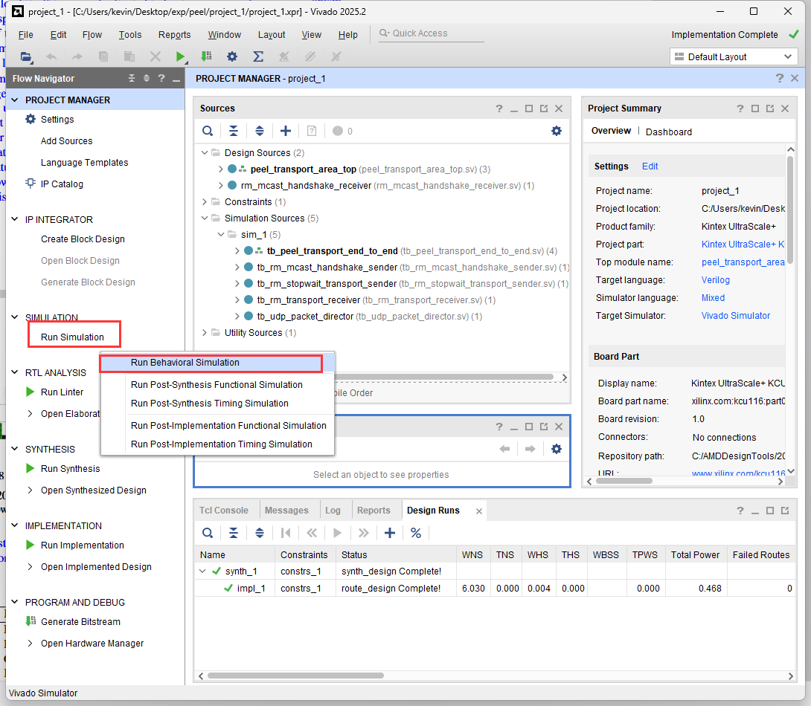
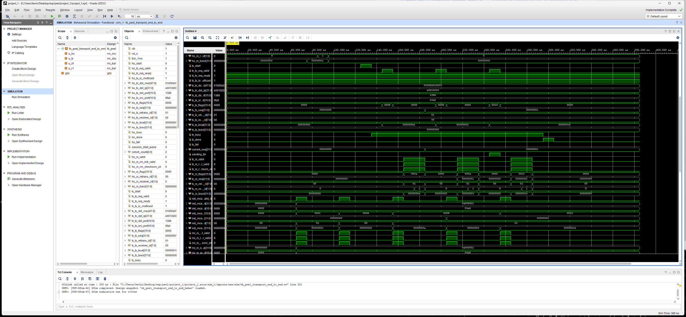
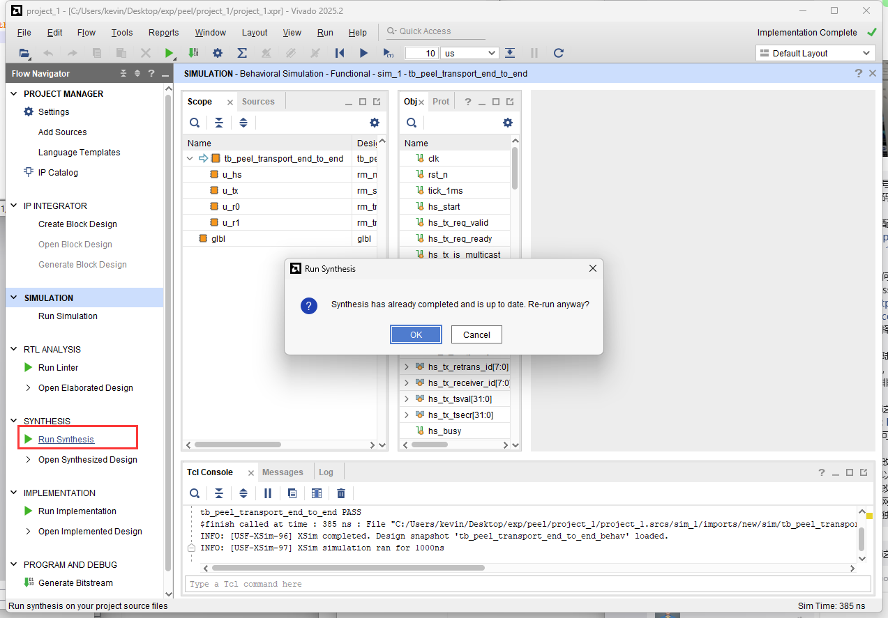
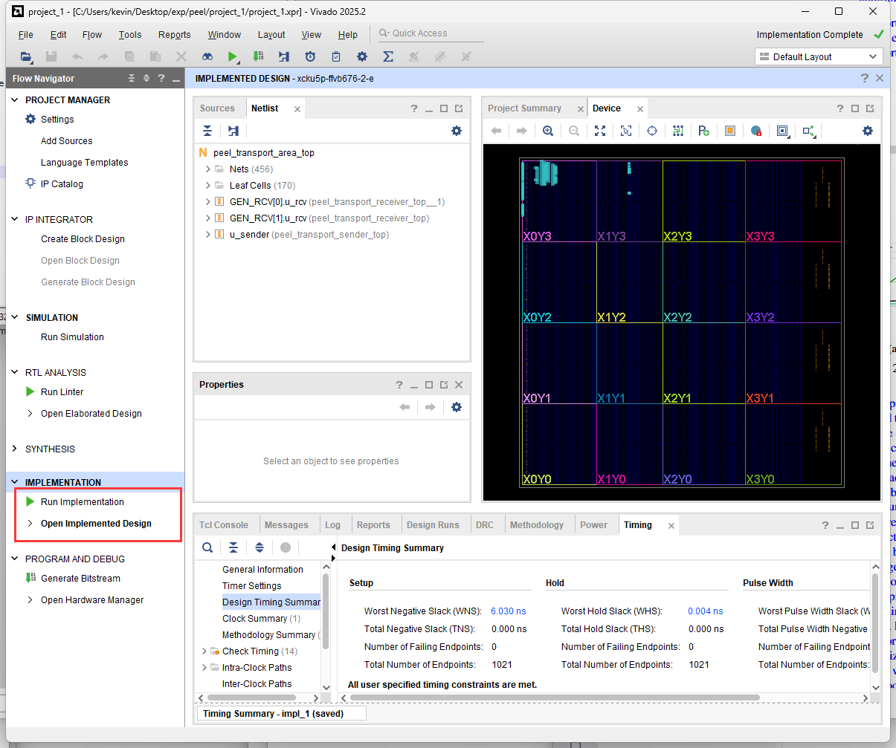
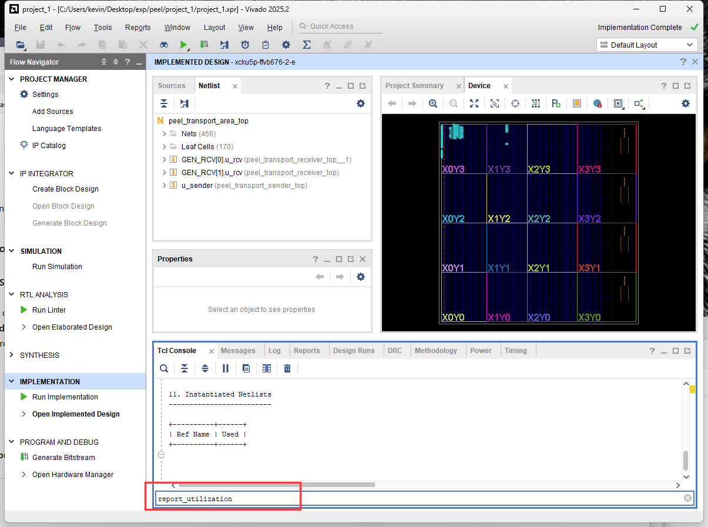

# PEEL FPGA Module

The PEEL FPGA module is not tied to a specific FPGA board model, as long as the target device provides sufficient hardware resources.
For our implementation and evaluation, we use the following FPGA device: `Kintex UltraScale+ XCKU5P-2FFVB676E`.
The design was developed and tested using `AMD Vivado 2025.2`.
This document explains how to open the provided Vivado project, run the included testbenches, synthesize and implement the design, and inspect FPGA resource utilization.

---

## Step 1: Prepare the Source Files

The complete Vivado project is provided as `PEEL/FPGA/peel_module.zip`.
Download `peel_module.zip` to the machine running Vivado and extract the archive.
For example, in our Windows environment, the extracted project is located at `Desktop/exp/peel/project_1`.

> **Note:** The exact location is not important as long as Vivado can access the project files.

---

## Step 2: Open the Vivado Project

Launch **AMD Vivado 2025.2** and select **Open Project**.



Navigate to the extracted project directory and select `project_1.xpr`.
Then click **Open**.



Once the project is loaded, the **Sources** panel displays the project's design sources and simulation sources.



---

## Step 3: Select a Testbench

Several testbench modules are included with the project for validating different parts of the PEEL FPGA design.
By default, the selected simulation top module is `tb_peel_transport_end_to_end`.
To select or verify the testbench:

1. Locate the **SIMULATION** section in the Flow Navigator.
2. Right-click **Simulation** and select **Simulation Settings**.



Under the simulation settings, verify that **Simulation top module name** corresponds to the testbench you want to run.



Different testbench modules can be selected to validate different stages or components of the PEEL hardware pipeline.

---

## Step 4: Run Behavioral Simulation

From the **SIMULATION** section, select **Run Simulation → Run Behavioral Simulation**.



Wait for Vivado to compile the simulation sources and launch the simulator.
After the simulation starts, the waveform viewer can be used to inspect the behavior of the selected testbench.



Depending on the testbench, different internal signals can be examined to verify the corresponding PEEL functionality.
For example, signals such as:

```text
tx_rx_valid
net_mcast_valid_d
```

can be monitored to identify when multicast packets are successfully received and parsed by the PEEL hardware pipeline.

---

## Step 5: Run Synthesis

To synthesize the FPGA design, navigate to the **SYNTHESIS** section in the Vivado Flow Navigator.



The provided project already contains synthesis results for the current design. You can either:

* Open the existing synthesized design, or
* Run synthesis again using **Run Synthesis**.

Running synthesis again is useful when modifying the RTL or targeting a different FPGA device.

---

## Step 6: Run Implementation

After synthesis completes, proceed to the **IMPLEMENTATION** section.



You can either:

* Open the provided implemented design, or
* Select **Run Implementation** to regenerate the implementation results.

Implementation performs the placement and routing of the synthesized design for the selected FPGA device.

---

## Step 7: Inspect Resource Utilization

To inspect the FPGA resource usage, open the **Tcl Console** in Vivado and run `report_utilization`.



Vivado will generate a detailed resource-utilization report showing the FPGA resources consumed by the PEEL design, including resources such as:

* LUTs
* Flip-flops
* BRAMs
* DSPs
* Other device-specific resources

The report can be used to evaluate the hardware footprint of the PEEL module and determine whether the design fits within the available resources of a target FPGA device.

---

## Using a Different FPGA Device

The PEEL module itself does not depend on the specific `XCKU5P-2FFVB676E` device used in our testbed.
To target a different FPGA, select the appropriate device or board in Vivado and rerun synthesis and implementation.
The target FPGA must provide sufficient resources for the PEEL design, and device-specific timing, interface, and resource constraints should be verified before deployment.
